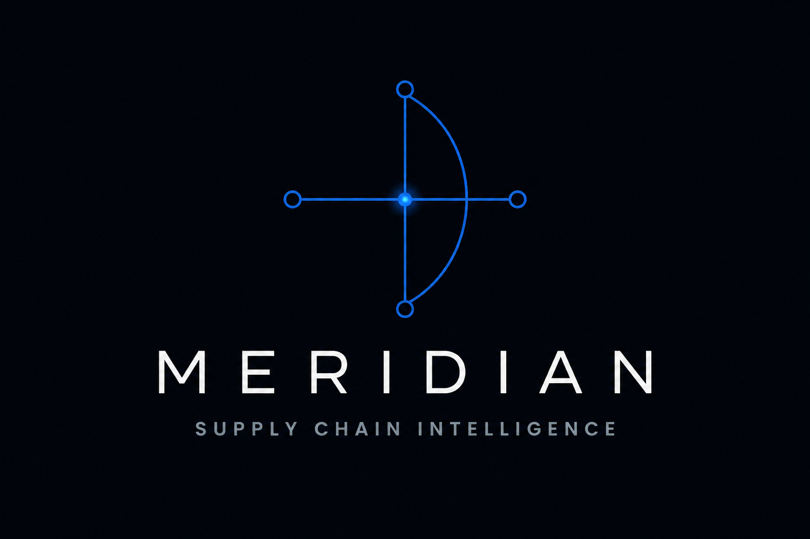

<div align="center">



# Meridian

**Autonomous Supply Chain ESG Compliance Intelligence Agent**

*"Meridian reads signals nobody has seen, from places nobody could reach."*

Built for the **Web Data UNLOCKED Hackathon** · Bright Data × lablab.ai · Track 3: Security & Compliance

<br/>


</div>

---

## Overview

Meridian autonomously monitors the **entire public web** — worker forums, NGO reports, regional regulatory portals, multilingual social media, and government databases — to detect human rights, environmental, and financial violation signals at supplier companies **4 to 8 weeks before** they escalate into public scandals or regulatory enforcement.

It is purpose-built for the three regulations reshaping global supply chains:

| Regulation | Jurisdiction | Maximum Penalty |
|------------|--------------|-----------------|
| **EU CSDDD** (Corporate Sustainability Due Diligence Directive) | EU, 500+ employees | 5% of global annual turnover |
| **US UFLPA** (Uyghur Forced Labor Prevention Act) | US imports | Import ban + fines |
| **Germany LkSG** (Lieferkettensorgfaltspflichtengesetz) | Germany, 1,000+ employees | 2% of annual turnover |

---

## Architecture

Meridian is a **3-service monorepo**. Each service is self-contained (no root-level package files).

```text
meridian/
├── frontend/      Next.js 15 · React 19 · App Router · TypeScript · Tailwind CSS v4
├── backend/       Node.js · Hono · TypeScript · Prisma · PostgreSQL · Redis · BullMQ
│   └── database/  Prisma schema, migrations, seed
├── backend-ai/    Python · FastAPI · LangGraph · AI/ML API + Featherless AI · Bright Data
└── docker-compose.yml
```

```text
 Frontend  ──REST/WS──▶  Backend (Hono)  ──BullMQ/Redis──▶  Backend AI (FastAPI)
 :3000                   :8000                               :8001
                            │                                   │
                      PostgreSQL                          GNSH Engine (LangGraph)
                       + Redis                            + Bright Data
                                                          + AI/ML API / Featherless
                                                          + Speechmatics · Groq
```

### The three core innovations
- **GNSH Engine** (Geo-Native Signal Harvesting) — a LangGraph multi-agent system that crawls 60+ multilingual sources using local-country IPs via Bright Data Residential Proxies.
- **VVS Scoring** (Violation Velocity Score, 0–100) — measures how fast risk signals accumulate, classifying suppliers into four stages: MURMUR → RIPPLE → WAVE → SURGE.
- **RMM** (Regulatory Mandate Mapper) — auto-maps suppliers to applicable regulations and generates reports in the exact format each regulator accepts (CSDDD / UFLPA / LkSG).

---

## AI & Intelligence Layer

| Provider | Role | Notes |
|----------|------|-------|
| **AI/ML API** (aimlapi.com) | Primary intelligence layer — in-pipeline signal enrichment (reasoning/extraction), report generation | OpenAI-compatible gateway, default `gpt-4o` |
| **Featherless AI** (featherless.ai) | Open-source serverless inference — post-scoring risk digest + report fallback | OpenAI-compatible, `meta-llama/Meta-Llama-3.1-8B-Instruct` |
| **Speechmatics** | Speech-to-text — transcribes audio evidence into compliance signals | Batch ASR API |
| **Groq** | Fast preprocessing — signal classification & translation | `llama-3.3-70b` |

Inside the GNSH LangGraph pipeline, harvested signals flow through an
`enrich_signals` node (AI/ML API reasoning) before VVS scoring, then a
`digest_signals` node (Featherless AI) after scoring. The report generator
routes through providers in priority order: **AI/ML API → Featherless AI →
deterministic placeholder**, so the platform degrades gracefully when a key is
missing.

---

## Bright Data Integration

All web-intelligence calls are centralized in `backend-ai/src/integrations/`.

| Tool | Usage |
|------|-------|
| **SERP API** | Multi-language news monitoring (EN, ZH, AR, VI) |
| **Web Unlocker** | Bypass geo-blocks on regional worker forums |
| **Scraping Browser** | Render JS-heavy platforms (Weibo, Maimai) |
| **Web Scraper API** | Structured data from NGO databases (BHRRC, KnowTheChain) |
| **Residential Proxies** | Local-country IP for geo-native access |
| **MCP Server** | Direct LangGraph agent web access |

---

## Quick Start

### Prerequisites

- Node.js 22 LTS
- pnpm 9+ (never npm/yarn)
- Python 3.12+
- Docker Desktop (local infrastructure)

### 1. Clone & configure

```bash
git clone <repo-url>
cd meridian
# Copy each service's env template and fill in your values:
cp frontend/.env.example   frontend/.env.local
cp backend/.env.example    backend/.env
cp backend-ai/.env.example backend-ai/.env
```

### 2. Start local infrastructure

```bash
docker-compose up -d   # PostgreSQL, Redis, Qdrant, MinIO
```

### 3. Backend (Hono)

```bash
cd backend
pnpm install
pnpm db:generate
pnpm db:migrate
pnpm db:seed
```

### 4. Frontend (Next.js)

```bash
cd ../frontend
pnpm install
```

### 5. Backend AI (FastAPI)

```bash
cd ../backend-ai
python -m venv .venv
.venv\Scripts\activate          # Windows  (use: source .venv/bin/activate on macOS/Linux)
pip install -r requirements.txt
playwright install chromium
```

### Run all three services

```bash
# Frontend   → http://localhost:3000
cd frontend   && pnpm dev

# Backend    → http://localhost:8000
cd backend    && pnpm dev

# Backend AI → http://localhost:8001
cd backend-ai && uvicorn src.main:app --reload --port 8001
```

> Demo login — email `demo@meridian.ai`, password `Demo@1234`

---

## Key Features

- **GNSH Engine** — Geo-Native Signal Harvesting across 60+ multilingual sources
- **VVS Scoring** — Violation Velocity Score (0–100) with 4 animated risk stages
- **Regulatory Mandate Mapper** — CSDDD, UFLPA, and LkSG report generation
- **Intelligence Briefs** — senior-analyst narrative reports via the AI/ML API (Featherless AI fallback)
- **Audio Evidence Transcription** — Speechmatics speech-to-text turns recordings into signals
- **Real-time Alerts** — WebSocket-powered multi-channel notifications (in-app, email, Slack)
- **Evidence Vault & Audit Trail** — immutable, regulator-ready evidence bundles

---

## Backend AI Endpoints

| Method | Endpoint | Purpose |
|--------|----------|---------|
| `GET`  | `/health` | Service health check |
| `POST` | `/api/v1/scan` | Trigger a GNSH monitoring scan for a supplier |
| `POST` | `/api/v1/reports/generate` | Generate a brief or `csddd`/`uflpa`/`lksg` report |
| `POST` | `/api/v1/transcribe` | Transcribe base64 audio evidence + extract a signal (Speechmatics + AI/ML API) |

---

## Deployment

Local development uses Docker. Production runs on managed cloud services with **no code changes** — only connection strings differ.

| Service | Local | Production |
|---------|-------|------------|
| Frontend | `pnpm dev` | **Vercel** |
| Backend / Backend AI | local process | **Hugging Face Spaces** (Docker) — or Railway/Render |
| PostgreSQL | Docker (TimescaleDB) | **Supabase** (pooled connection) |
| Redis | Docker | **Upstash** (TLS `rediss://`) |
| Vector DB | Docker (Qdrant) | **Qdrant Cloud** (URL + API key) |
| Object storage | Docker (MinIO) | **Supabase Storage / AWS S3** |

Each service has its own `.env.example` (`frontend/`, `backend/`, `backend-ai/`) — copy it and fill in your values.

---

## Tech Stack

**Frontend** · Next.js 15, React 19, TypeScript, Tailwind CSS v4, Framer Motion, shadcn/ui, Recharts, Mapbox GL JS, Zustand, TanStack Query, React Hook Form + Zod

**Backend** · Node.js, Hono, Prisma, PostgreSQL (TimescaleDB), Redis, BullMQ, Socket.IO, Nodemailer

**Backend AI** · Python 3.12, FastAPI, LangGraph, LangChain, OpenAI SDK (AI/ML API + Featherless), Speechmatics, Groq, Qdrant, Playwright

---

<div align="center">

*Web Data UNLOCKED Hackathon · Bright Data × lablab.ai · Track 3: Security & Compliance*

</div>
